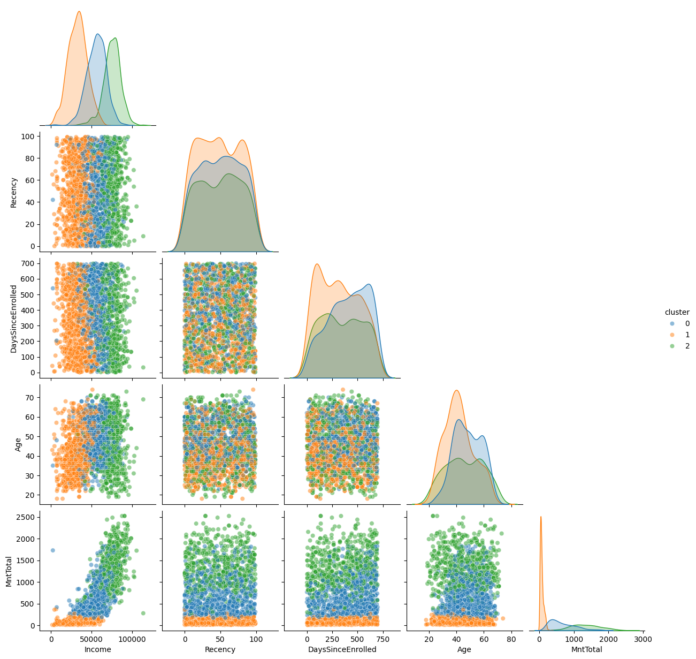
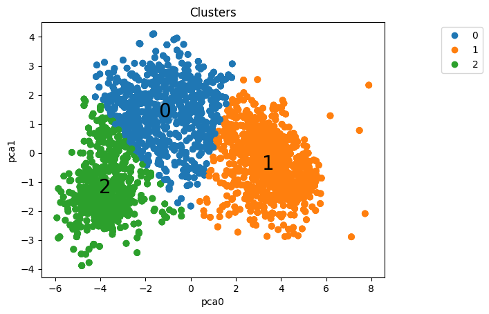
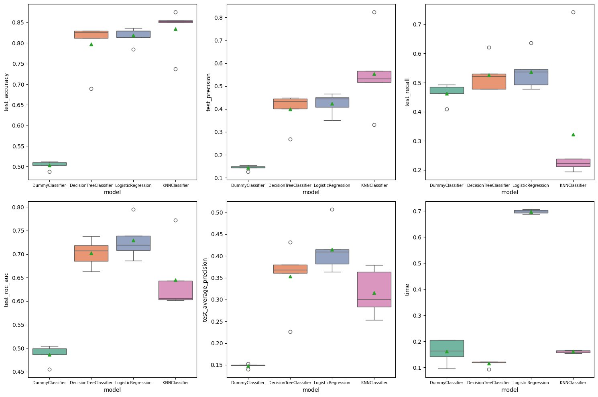

# Case iFood - Descrição do case

Considere uma empresa bem estabelecida que atua no setor de varejo de alimentos. Atualmente, eles têm cerca de vários milhares de clientes registrados e atendem quase um milhão de consumidores por ano. Eles vendem produtos de 5 grandes categorias: vinhos, carnes, frutas exóticas, peixes especialmente preparados e produtos doces. Estes podem ser divididos ainda mais em produtos de *gold* e regulares. Os clientes podem encomendar e adquirir produtos por meio de 3 canais de vendas: lojas físicas, catálogos e site da empresa. Globalmente, a empresa teve receitas sólidas e uma linha de fundo saudável nos últimos 3 anos, mas as perspectivas de crescimento dos lucros para os próximos 3 anos não são promissoras... Por esse motivo, várias iniciativas estratégicas estão sendo consideradas para inverter essa situação. Um deles é melhorar o desempenho das atividades de marketing, com foco especial em campanhas de marketing.

# Case iFood - Analista de dados

Este projeto simula uma análise baseada em um processo seletivo para a posição de Analista de Dados no iFood. A empresa atua no setor de varejo de alimentos, atendendo milhares de clientes anualmente e vendendo produtos em cinco categorias principais: vinhos, carnes, frutas exóticas, peixes especialmente preparados e produtos doces. Os produtos são divididos em duas classes: *gold* e regulares, e são vendidos por meio de três canais: lojas físicas, catálogos e o site da empresa.

Nos últimos três anos, a empresa manteve uma receita sólida, mas as projeções de crescimento futuro não são promissoras. Por isso, uma das iniciativas estratégicas é melhorar o desempenho das campanhas de marketing para reverter esse cenário.

Este projeto foi utilizado em um curso de Ciência de Dados oferecido pela [Hashtag Treinamentos](https://www.hashtagtreinamentos.com/), e é baseado no processo seletivo do iFood disponível [neste repositório](https://github.com/ifood/ifood-data-business-analyst-test).

Para mais detalhes sobre o case, acesse [aqui](case/README.md).

 
   

## Objetivos do Projeto

O principal objetivo deste projeto é demonstrar a importância do pré-processamento e da análise exploratória de dados em um contexto real. Além disso, o projeto destaca como apresentar resultados de maneira eficaz para diferentes públicos: técnicos e não técnicos.

### Objetivos detalhados:

- Realizar uma análise exploratória detalhada dos dados.
- Segmentar os clientes da base de dados.
- Construir um modelo de classificação para prever se um cliente irá comprar um produto durante uma campanha.
- Demonstrar boas práticas em projetos de Ciência de Dados, utilizando notebooks, scripts, relatórios e repositórios no GitHub.
- Seguir boas práticas de programação em Python, como o uso de funções e scripts para reaproveitamento de código.
- Aplicar boas práticas no uso do SciKit-Learn, com pipelines e otimização de hiperparâmetros.

## Estrutura do Repositório

A estrutura do repositório está organizada da seguinte maneira:

├── case ├── data ├── images ├── notebooks ├── reports

- **`data/`**: contém os dados utilizados no projeto. O arquivo principal é o `ml_project1_data.csv`, e os demais são datasets gerados ao longo do projeto.
- **`images/`**: armazena as imagens utilizadas no README.
- **`notebooks/`**: contém os notebooks com o desenvolvimento do projeto.
- **`reports/`**: guarda os relatórios gerados com a biblioteca [ydata-profiling](https://github.com/ydataai/ydata-profiling).

## Detalhes do Dataset e Resumo dos Resultados

Para uma descrição detalhada do dataset utilizado, acesse [aqui](data/README.md).

Após realizar o pré-processamento, PCA e aplicar K-Means, os clientes foram segmentados em 3 clusters:

### Análise dos Clusters:

- **Cluster 0**: 
  - Renda intermediária
  - Gasto intermediário
  - Provavelmente tem filhos
  - Pode aceitar campanhas
  - Pessoas de idade mais elevada

- **Cluster 1**: 
  - Renda alta
  - Gasto alto
  - Muito provavelmente não tem filhos
  - Mais propenso a aceitar campanhas
  - Sem pessoas com escolaridade básica
  - Sem perfil de idade destacado

- **Cluster 2**: 
  - Renda baixa
  - Gasto baixo
  - Provavelmente tem filhos
  - Baixa propensão a aceitar campanhas
  - Único cluster com uma porcentagem significativa de pessoas com escolaridade básica
  - Pessoas mais jovens

### Modelos de Classificação

Três modelos de classificação foram treinados para prever a compra de produtos durante as campanhas:

- Regressão Logística
- Decision Tree
- KNN

Um `DummyClassifier` foi utilizado como baseline, e os modelos foram comparados com base em 6 métricas:

A partir dessa comparação, o modelo de **Regressão Logística** foi selecionado para otimização de hiperparâmetros.

## Como Reproduzir o Projeto

Para reproduzir este projeto, utilize Python 3.11.5. É recomendável criar um ambiente virtual com Conda ou outra ferramenta similar, e então instalar as bibliotecas abaixo:

| Biblioteca       | Versão |
| ---------------- | ------ |
| Imbalanced-Learn | 0.11.0 |
| Matplotlib       | 3.7.2  |
| NumPy            | 1.24.3 |
| Pandas           | 1.5.3  |
| Scikit-Learn     | 1.3.0  |
| Seaborn          | 0.12.2 |

Caso deseje reproduzir os relatórios gerados, instale também a biblioteca [ydata-profiling](https://github.com/ydataai/ydata-profiling).

---

Realizado por Gabriel Rodrigues. Para saber mais, acesse [meu LinkedIn](linkedin.com/in/gabrielralves/).
